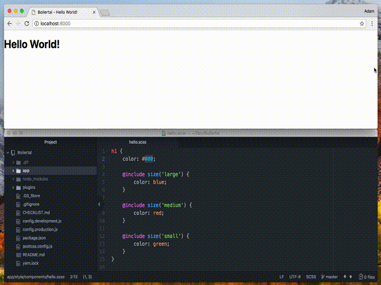

# Boilertal
Another boilerplate project, but this one has Swag and Emojis 👾 made by https://igital.co.

*	Hot reloading dev server 😍
*	Swag Sass Framework 💎
*	Super simple responsive css ⭐️
*	Compiled ES6 Javascript 😎

## Responsive example


## Configuration
Before you install and run the webpack compiler, edit the config ***/app/config/settings.json*** and insert your values there,
you can use settings variables from the json file in the templates.

## Install and start swaggin'
```
git clone https://github.com/ro0t/Boilertal.git
cd Boilertal
yarn
npm run dev
```
Use ***npm run build*** for production

## Stylesheets
Edit the config files in ***/app/style/config/*** to fit your needs.
Place your component stylings in ***/app/style/components/*** and load them at the bottom of ***/app/style/swag.scss***.

## Javascript Code
All of your javascript should be in ***/app/src/***, and you can import it from the bootstrap file ***/app/bootstrap.js***.

## The checklist
In the project you can find a **CHECKLIST.md** file to help you prepare for launching your website.

*	[x] Started using Boilertal
*	[x] Imported the Igital Swag Sass Framework
*	[ ] Favicon
*	[ ] Meta description and default open graph tags have been added
*	[ ] Google Analytics ID inserted
*	[ ] Minified Javascript & CSS
*	[ ] Images have been optimized
*	[ ] Tested in all browsers (except IE 🤮)
*	[ ] Proofread all content
*	[ ] Make sure all links work, test clicking on all of them 😈
*	[ ] Add a sitemap
*	[ ] Validation, validate them forms!!1
*	[ ] Added a Print stylesheet? Check how your web looks in print mode CMD+P
*	[ ] Test your entire website... 🤡

## Special thanks
The web penguin Jón Þór for showing me 30 Seconds of CSS. 😍

Thanks to Atomiks (https://github.com/atomiks/30-seconds-of-css) for all the tips and tricks. ⭐️
